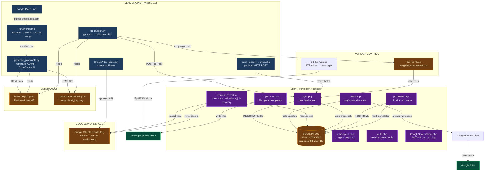
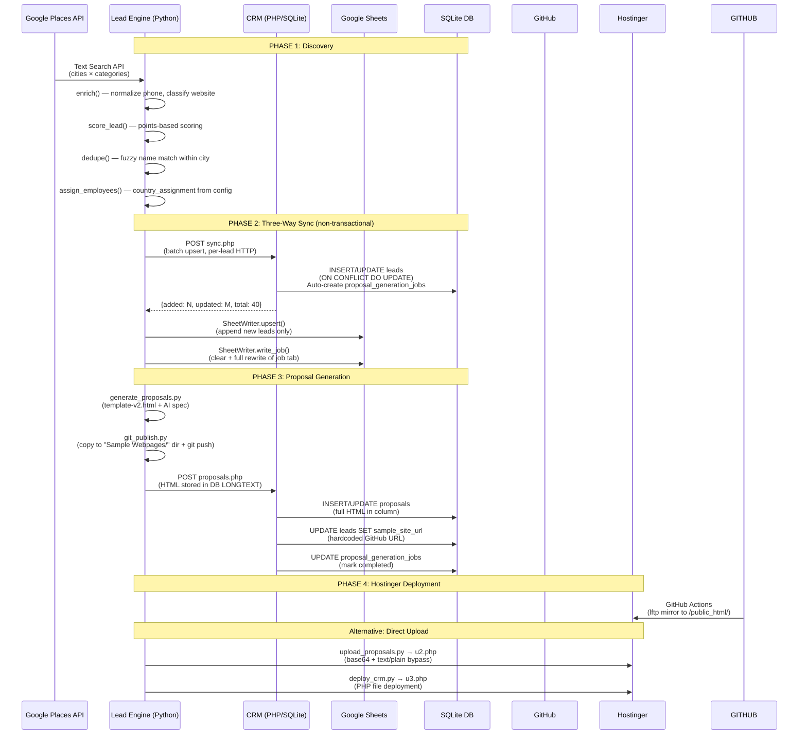
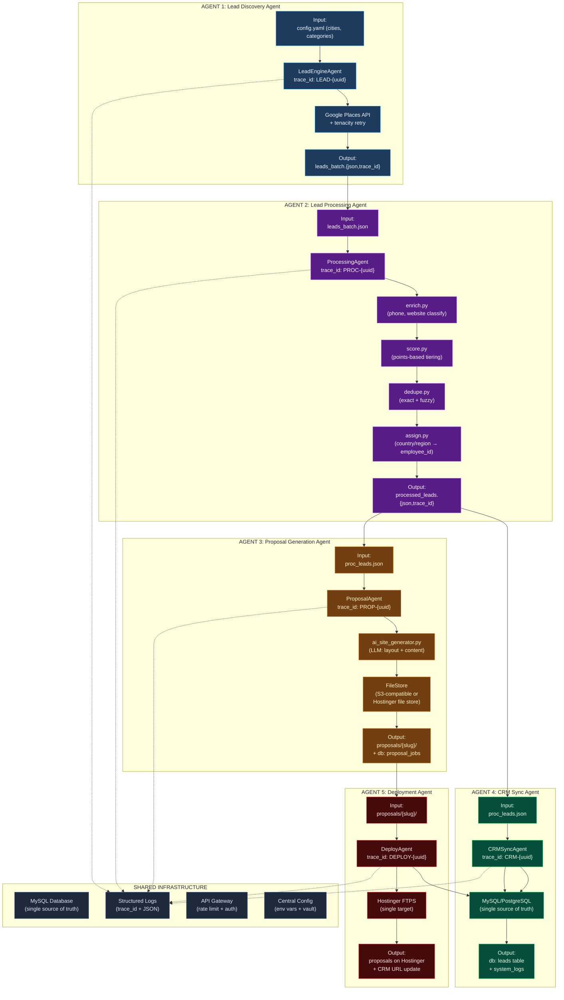
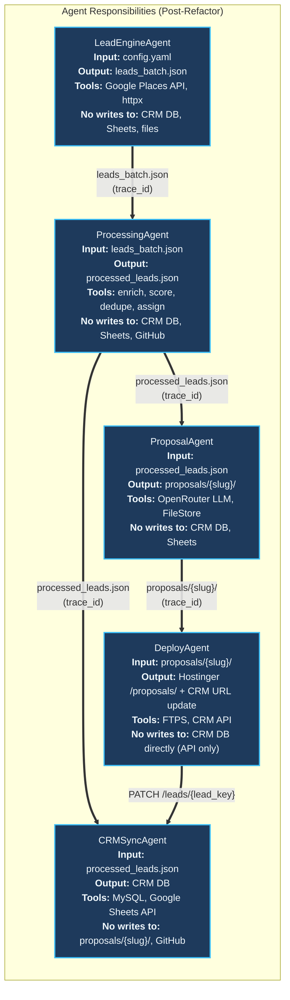
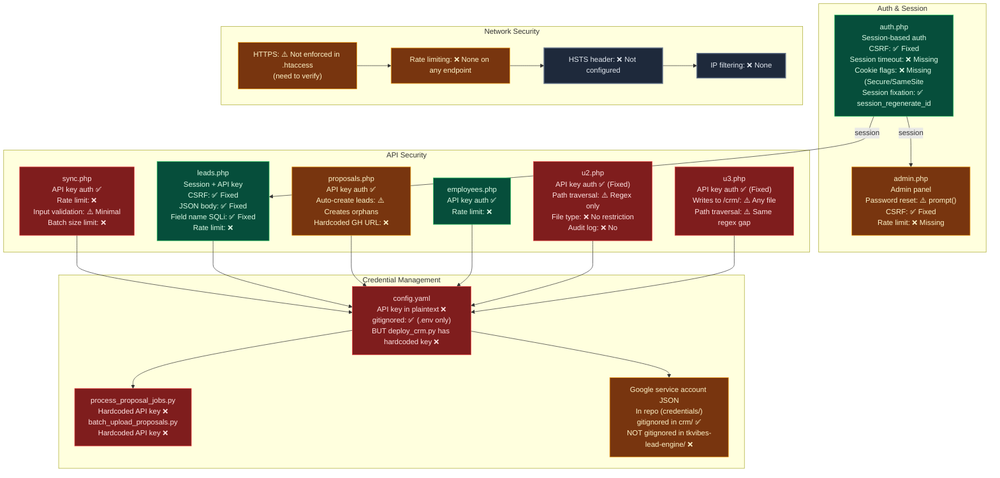

# TKVibes AI CRM — Architecture Diagrams

> **Note:** All diagrams below are in Mermaid format. Render with any Mermaid-compatible viewer (GitHub, VS Code, mermaid.live, Obsidian).

---

## 1. Current State Architecture (High Level)

---

## 2. Current State Data Flow (Detailed)

---

## 3. Target State Architecture (Post-Refactor)

---

## 4. Agent Responsibility Matrix

---

## 5. Deployment Conflict Diagram (Current State Problem)

```mermaid
graph TD
    subgraph "FIVE COMPETING DEPLOYMENT PATHS"
        P1["FLOW A: Lead Engine → GitHub<br/>generate_proposals → git_publish<br/>→ git commit+push<br/>→ raw.githubusercontent.com URLs<br/>→ sync.php updates CRM"]
        P2["FLOW B: GitHub Actions → Hostinger<br/>git push → deploy.yml<br/>→ lftp mirror to /public_html/<br/>→ overwrites everything"]
        P3["FLOW C: Direct Upload → Hostinger<br/>upload_proposals.py → u2.php<br/>→ /proposals/sample-website/<br/>→ batch_upload_proposals.py<br/>→ git commit (but no CRM update)"]
        P4["FLOW D: CRM Deploy → Hostinger<br/>deploy_crm.py → u3.php<br/>→ /crm/*.php files<br/>→ overwrites PHP code"]
        P5["FLOW E: Server-side Local Deploy<br/>deploy_proposals.php (cron)<br/>→ scans DB for GitHub URLs<br/>→ copies to /proposals/<br/>→ OVERWRITES GitHub URLs in DB<br/>→ breaks proxy_proposal.php"]
    end

    P1 -.->|"Competing URL formats"| P5
    P2 -.->|"Overwrites files from P1,P3"| P5
    P3 -.->|"No CRM update, relies on P5"| P5
    P4 -.->|"Overwrites CRM code while cron runs"| P1

    classDef flowA fill:#1e3a5c,stroke:#38bdf8
    classDef flowB fill:#581c87,stroke:#a855f7
    classDef flowC fill:#713f12,stroke:#d97706
    classDef flowD fill:#064e3b,stroke:#22c55e
    classDef flowE fill:#7f1d1d,stroke:#ef4444,color:#fee2e2
    classDef conflict fill:#7f1d1d,stroke:#ef4444,stroke-width:3,color:#fee2e2

    class P1 flowA
    class P2 flowB
    class P3 flowC
    class P4 flowD
    class P5 conflict

    classDef conflict-arrow stroke:#ef4444,stroke-width:3,stroke-dasharray:8,4
    P1 -.->|conflict| P5
    P2 -.->|conflict| P5
    P3 -.->|conflict| P5
    P4 -.->|conflict| P1
```

---

## 6. Security Posture Diagram

---

## 7. Three Data Stores → Single Source of Truth Migration

```mermaid
graph LR
    subgraph "CURRENT: Three Data Stores"
        DB1["SQLite DB<br/>(CRM source of truth)<br/>leads, proposals, activities"]
        SHEET1["Google Sheets<br/>(Lead engine source)<br/>Leads tab + per-job tabs"]
        JSON1["JSON Files<br/>(handoff format)<br/>leads_export.json<br/>_generation_results.json"]
    end

    subgraph "CURRENT: Data Flow (Circular)"
        F1["Engine writes<br/>to DB via sync.php"]
        F2["Engine writes<br/>to Sheets via gspread"]
        F3["CRM reads from<br/>Sheets (cron task #3)"]
        F4["CRM writes back<br/>to Sheets (cron task #4)"]
        F5["Engine reads<br/>from JSON export"]
    end

    DB1 --- F1
    SHEET1 --- F2
    SHEET1 --- F3
    SHEET1 --- F4
    JSON1 --- F5
    F1 --- DB1
    F2 --- SHEET1
    F3 --- DB1
    F4 --- SHEET1

    style DB1 fill:#7f1d1d,stroke:#ef4444
    style SHEET1 fill:#7f1d1d,stroke:#ef4444
    style JSON1 fill:#7f1d1d,stroke:#ef4444

    subgraph "TARGET: Single Source of Truth"
        DB2["MySQL/PostgreSQL<br/>(single source of truth)<br/>leads, proposals<br/>(file paths, not HTML)<br/>activities, system_logs<br/>proposal_generation_jobs"]
    end

    subgraph "TARGET: Data Flow (Linear)"
        G1["Engine discovers leads"]
        G2["Engine processes + enriches"]
        G3["Engine writes to DB via sync.php (transactional)"]
        G4["CRM reads from DB (no sheet sync needed)"]
        G5["Proposal agent reads from DB jobs queue"]
        G6["Deploy agent writes files, URL to DB"]
    end

    G1 --> G2 --> G3 --> DB2
    DB2 --> G4
    DB2 --> G5
    G5 --> G6 --> DB2

    style DB2 fill:#064e3b,stroke:#22c55e
```

